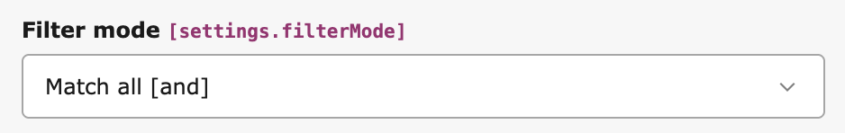
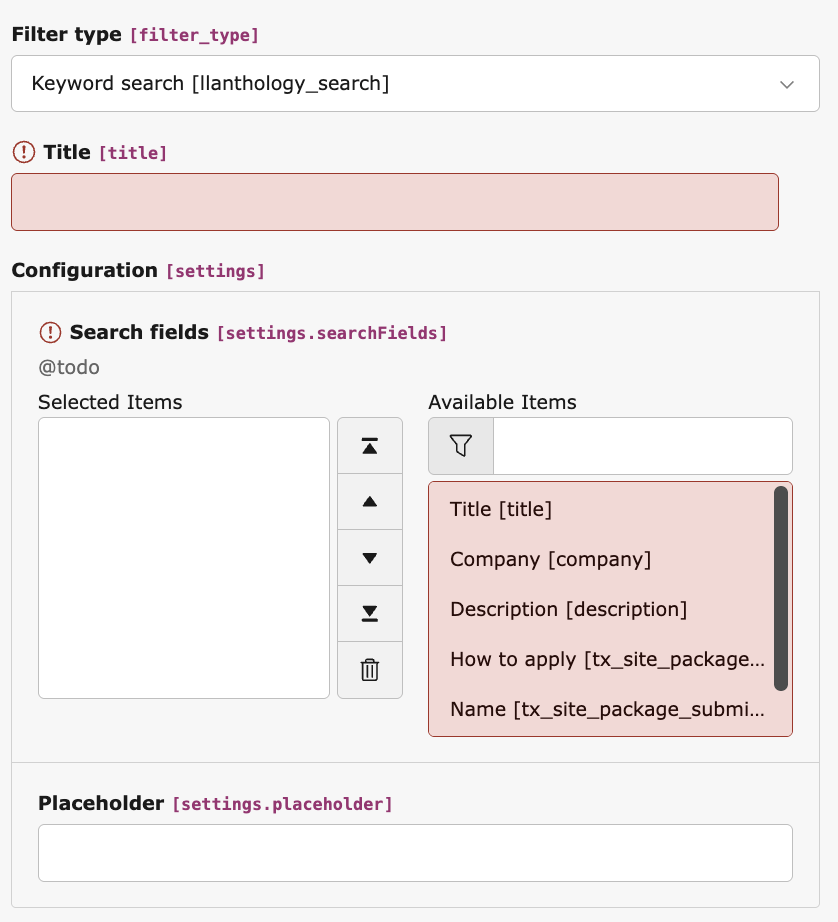
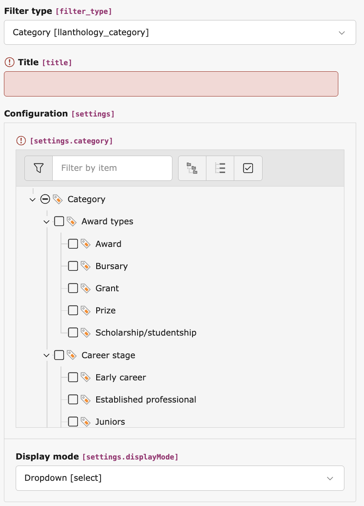
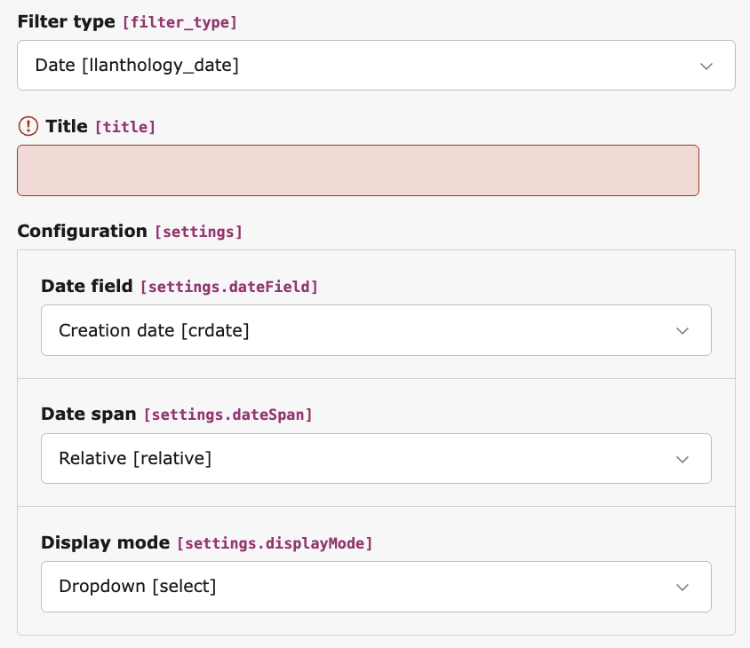

.. include:: ../Includes.rst.txt

=======
Filters
=======

Filtering options
=================

Filter mode
-----------

   Configuring Anthology's filter mode

The filter mode determines how filters are combined, if only one filter is available, this option is irrelevant.

**Match all**
	A record must match all the supplied filters in order to be returned, this will return fewer results, but the results returned will match the users' intent more closely. This would be useful for job vacancies for example, where a user will want to match specific criteria and exclude matches which aren't exact.

**Match any**
	A record will be returned if it matches any of the filters. This will return more results, but their correlation to what the user requires may be lower. This would be useful for news articles where a user may want to see any records which match a keyword, or are in a given category

Display modes
-------------

Most filters have multiple options for display modes (with the obvious exception of Keyword search):

**Dropdown**
	Renders a select box

**Checkbox**
	Actually a radio button, but "checkbox" makes it clearer for integrators

**Link**
	Renders a link, this will retain previously selected filters, but it will not retain values which have been entered since the page loaded

Available filters
=================

.. seealso::
	For more detailed information on custom filters, see the :doc:`../Developers/CustomFilters` guide.

Keyword search
--------------

Keyword search allows users to search across multiple fields using a single search input. The available fields are configured through the filter, and any text based field configured in the record's TCA is available

   Configuring Anthology's keyword filter

It is possible to include multiple fields in the keyword search, and results will be returned if they entered keyword is found in any of them

Category
--------

Category filters allow users to filter records based upon the records' selected TYPO3 categories	. Only one parent category should be selected per filter, if filtering across more than one category is required, another category filter should be added. Select the parent category for the filter categories, and all child categories will be included.

   Configuring Anthology's category filter

Date
----

Date filters allow filtering based upon datetime values, as well as selecting the field to filter by, it is also possible to configure what date options are available

**Relative**
	Will display dates relative to the current date.

	The following options are available:
		- 24 hours
		- 7 days
		- 1 month
		- 3 months
		- 6 months
		- 1 year

	This is useful for time sensitive records, for example displaying recently added job vacancies or frequently updated news.

**Months**
	Displays options based upon available months in the records. This will be constrained to the first and last date in the range of the selected field.

	This is useful for records which have a medium range time archive, for example, sporadically updated news or events

**Years**
	Displays options based upon available years in the records. This will be constrained to the first and last date in the range of the selected field.

	This is useful for records which have a large time archive, for example, infrequently updated news or events

   Configuring Anthology's date filter

.. note::
	Date ranges are currently only available for past dates, future date ranges will be available in a future release.

.. note::
	Many models do not include datetime fields generated internally, for example, `crdate` or `tstamp`. In order to enable these fields for filtering, they must be added to the model's TCA configuration and if the model is an external model, added to the model (see: :doc:`../Developers/ExternalRepositories`)
