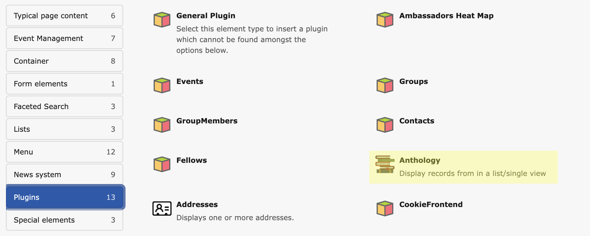
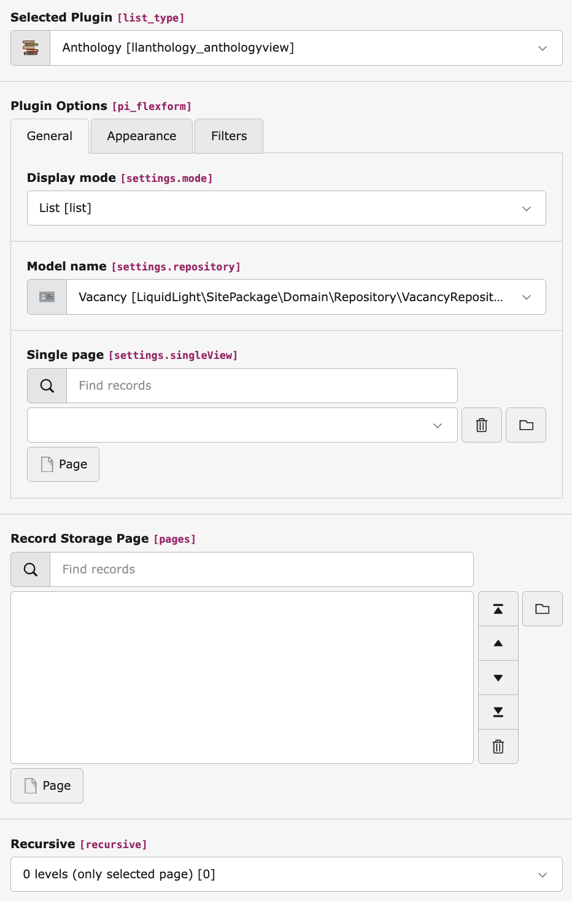
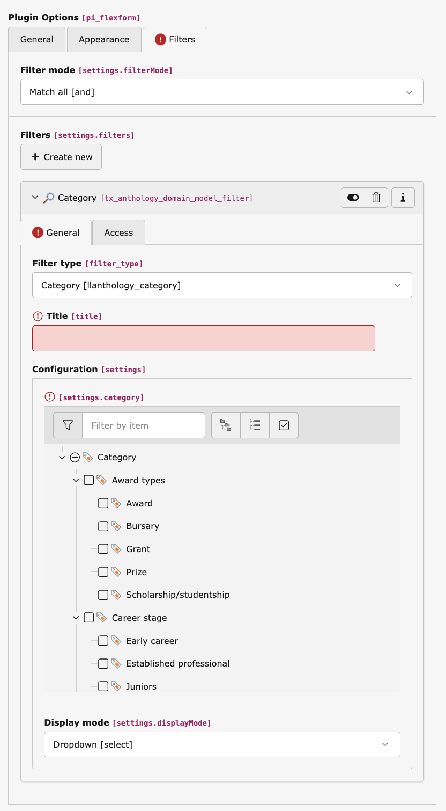
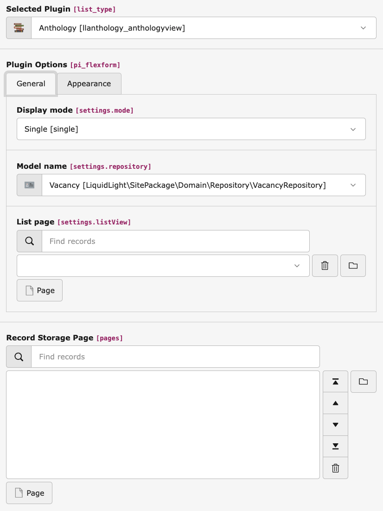

.. include:: ../Includes.rst.txt

======
Plugin
======

List View
=========

Add plugin to page
------------------

1. Add the Anthology plugin to the page where you want the list view to appear via the New Page Content Wizard.

   Adding the Anthology plugin to a page

2. Configure the plugin, ensure the following minimum settings are applied:

   Configuring the Anthology plugin in list mode

- **Display mode:** List
- **Model name:** Select your model. If your model is not listed, ensure it has been configured correctly, see :doc:`../QuickStart/Index` for instructions
- **Single page:** Select the page where the single view plugin is located (if required)
- **Record Storage Page:** Select where your records are stored

3. Configure filters (if required)

   Configuring filters for the Anthology plugin

- Navigate to the **Filters** tab, and add any required filters. Anthology comes with a set of commonly used filter types already available, see :doc:`Filters` for more information

Single View
===========

1. Add the Anthology plugin to the page where you want the single view to appear via the New Page Content Wizard.

   Adding the Anthology plugin to a page

2. Configure the plugin, ensure the following minimum settings are applied:

   Configuring the Anthology plugin in single view mode

- **Display mode:** Single
- **Model name:** Select your model. If your model is not listed, ensure it has been configured correctly: :doc:`../QuickStart/Index`
- **List page:** Select the page where the list view plugin is located
- **Record Storage Page:** Select where your records are stored
